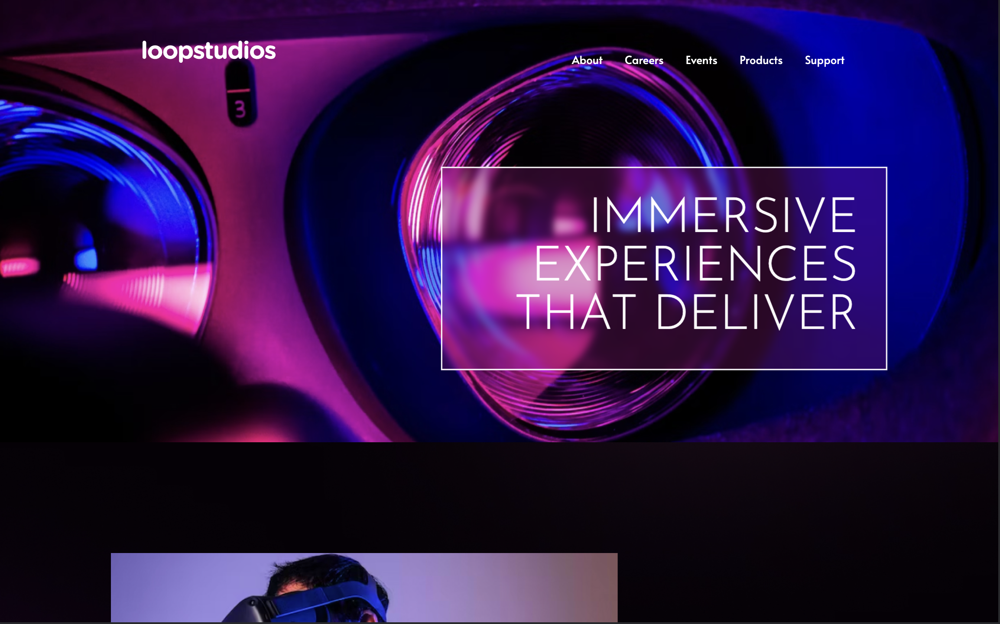

# Frontend Mentor - Loopstudios landing page solution

This is a solution to the [Loopstudios landing page challenge on Frontend Mentor](https://www.frontendmentor.io/challenges/loopstudios-landing-page-N88J5Onjw). Frontend Mentor challenges help you improve your coding skills by building realistic projects. 

### Screenshot

### Links

- Solution URL: [solution URL here] (https://www.frontendmentor.io/solutions/loopstudios-landing-page-with-redesign-7lwEucytak)
- Live Site URL: [live site URL here] (https://adorable-cucurucho-7b8678.netlify.app/)

### Built with

- Semantic HTML5 markup
- CSS custom properties
- Flexbox
- Custom design

## Author

- Website - [Valeriia Isaienko](https://valeriia-code.com)
- Frontend Mentor - [@Magic1vy](https://www.frontendmentor.io/profile/Magic1vy)
- LinkedIn - [Valeriia Isaienko](https://www.linkedin.com/in/valeriia-code)
